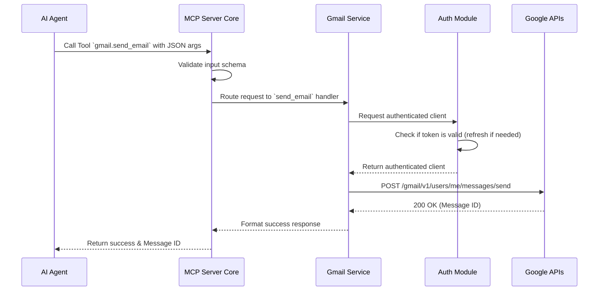

# Architecture Document: MCP Server for Google Workspace

## 1. System Context & Overview

The MCP Server acts as an intermediary bridge between AI Agents (like Claude Desktop, OpenAI, or Cursor) and the Google Workspace APIs. It leverages the Model Context Protocol (MCP) to expose standardized tools for AI clients without requiring them to implement any Google-specific integrations or auth logic.

```mermaid
graph TD
    Client[AI Client / Agent\n(Claude, Cursor, etc.)]
    MCPServer[MCP Server\n(Node.js / Docker)]
    GoogleAPI[Google APIs\n(Gmail, Docs)]

    Client <-->|MCP Protocol (JSON-RPC)| MCPServer
    MCPServer <-->|HTTPS / REST API| GoogleAPI
```

## 2. Core Components

The architecture is designed to be **modular**, **extensible**, and **stateless** (except for token storage, which can be externalized).

- **MCP Server Core (`src/server`)**: Bootstraps the Model Context Protocol server. It handles the JSON-RPC communication, input validation for tool arguments, and routing the requests to the specific service handlers.
- **Auth Service (`src/auth`)**: Manages the OAuth 2.0 lifecycle. It securely stores tokens, handles token refreshing, and provides authenticated Google API clients to the service layer.
- **Gmail Service (`src/gmail`)**: Implements tools specifically for Gmail API endpoints (e.g., sending emails, creating drafts).
- **Docs Service (`src/docs`)**: Implements tools specifically for Google Docs API endpoints (e.g., appending content).
- **Logging & Telemetry**: Intercepts requests and responses for structured logging, observability, and debugging.

## 3. High-Level Component Diagram

```mermaid
graph TD
    subgraph "AI Environment"
        Agent(AI Agent)
    end

    subgraph "MCP Server"
        Transport[Transport Layer\n(stdio/SSE)]
        Router[Tool Router]
        
        Auth[Auth Module\n(OAuth 2.0)]
        TokenStore[(Token Store)]

        subgraph "Services"
            GmailSvc[Gmail Service]
            DocsSvc[Docs Service]
        end
    end

    subgraph "Google Cloud"
        GmailAPI[Gmail API]
        DocsAPI[Google Docs API]
    end

    Agent <--> Transport
    Transport --> Router
    Router --> GmailSvc
    Router --> DocsSvc
    
    GmailSvc --> Auth
    DocsSvc --> Auth
    Auth <--> TokenStore
    
    GmailSvc <--> GmailAPI
    DocsSvc <--> DocsAPI
```

## 4. Sequence & Data Flow

### 4.1 Typical Tool Execution (e.g., `gmail.send_email`)



## 5. Authentication & Token Management

The system relies on OAuth 2.0. Since the server is agent-agnostic, the AI agent itself doesn't hold the tokens.

- **Initialization Flow**: When an unauthenticated user attempts to use a tool, or upon startup, the server prompts an OAuth consent flow to acquire the `access_token` and `refresh_token`.
- **Token Storage**: Tokens should be stored securely. Initially, this can be an encrypted local file store (like `.tokens.json`), but the architecture should abstract the storage interface so it can be swapped with a database (e.g., Redis, PostgreSQL) in a multi-user, cloud-deployed environment.
- **Auto-Refresh**: Before any API call, the Auth Module checks the token expiration. If expired, it uses the `refresh_token` to fetch a new `access_token` silently.

## 6. Resilience & Error Handling

To ensure reliability, the server implements robust error handling:

- **Input Validation**: Uses libraries (like Zod) to validate tool arguments before they reach the service layer. Invalid requests return a clean `invalid_params` error to the AI agent.
- **Transient Failures**: Google APIs may rate limit or return 500 errors. The server should use a retry mechanism with exponential backoff for transient failures (e.g., `503 Service Unavailable`, `429 Too Many Requests`).
- **Error Sanitization**: Raw stack traces and raw Google API error responses are sanitized before being returned to the AI agent to prevent leaking internal configurations or sensitive tokens.

## 7. Future Extensibility

Adding a new tool (e.g., `calendar.create_event`) follows a strict pattern that requires zero changes to the core MCP server routing logic:

1. Create a new module folder: `src/calendar/`.
2. Define the tool schema (inputs/outputs) in a standardized format.
3. Implement the tool logic function (fetching an authenticated client from `src/auth` and calling the Calendar API).
4. Register the new tool in the central Tool Registry exposed by the MCP Server Core.

This structure allows the project to grow indefinitely without becoming a monolith of spaghetti code.
